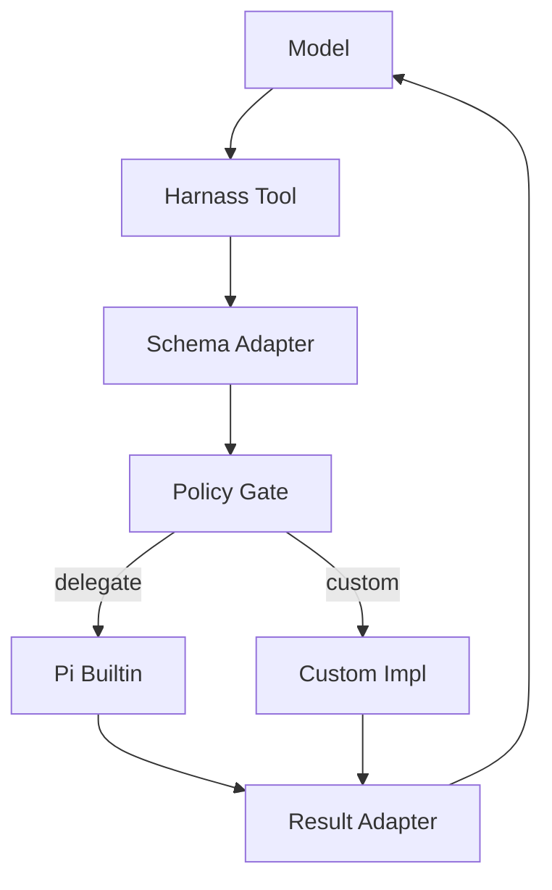
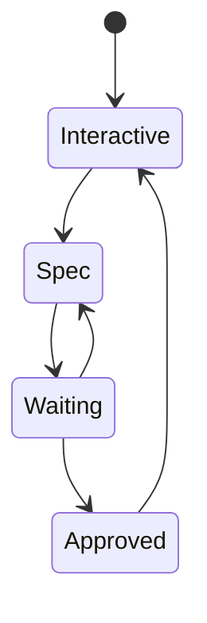

# Harnass To Pi Tool Port Plan

## Goal

Port the harnass tool surface into Pi while minimizing long-term maintenance by wrapping existing Pi tools wherever possible. The guiding principle is to expose harnass-compatible schemas and behavior at the model boundary, then delegate execution to Pi built-ins for shared primitives such as file reads, directory listing, search, file edits, writes, and shell execution.

The compatibility layer should only implement custom logic where harnass semantics exceed Pi's built-in capabilities, where stronger policy enforcement is required, or where the tool is a harnass-specific control-plane capability.

## Architecture Overview

The port should be structured as a Pi extension that registers harnass-compatible tools through Pi's extension API. Each tool should follow the same core pipeline:

1. Accept the harnass tool schema.
2. Normalize and validate arguments.
3. Apply centralized mode, path, shell, URL, and trust policy.
4. Delegate to a Pi built-in tool when one provides the underlying capability.
5. Run custom implementation code only for missing harnass-specific behavior.
6. Adapt the result into the expected harnass-style response.

## Design Principles

- Prefer Pi built-ins for common capabilities instead of reimplementing filesystem, search, edit, write, and shell behavior.
- Keep harnass compatibility at the tool boundary, not by forking Pi internals.
- Centralize policy enforcement so Spec Mode, shell risk rules, path boundaries, URL validation, and trust checks are consistent across tools.
- Preserve Pi-native session behavior by storing state in session/tool-result details where possible.
- Use Pi's mutation queue for all custom file writes so parallel tool execution cannot race against built-in edit/write tools.
- Keep custom tools small and focused on harnass-only semantics.

## Tool Port Matrix

| Harnass tool    | Pi reuse strategy                        | Implementation overview                                                                                                                             |
| --------------- | ---------------------------------------- | --------------------------------------------------------------------------------------------------------------------------------------------------- |
| `Read`          | Wrap Pi `read`                           | Translate harnass path and media options into Pi read arguments. Reuse Pi truncation and file/media handling where available.                       |
| `LS`            | Wrap Pi `ls`                             | Delegate directory listing to Pi and add harnass ignore-pattern filtering where Pi does not provide it directly.                                    |
| `Grep`          | Wrap Pi `grep`                           | Translate harnass ripgrep-like options into Pi grep options. Post-process results for output modes, context shaping, and limits when necessary.     |
| `Glob`          | Wrap Pi `find`                           | Map harnass glob patterns to Pi find calls. Merge, dedupe, and apply exclude patterns in the wrapper.                                               |
| `Edit`          | Wrap Pi `edit`                           | Translate harnass single-file replacement semantics to Pi edit operations. Rely on Pi's built-in mutation safety.                                   |
| `Create`        | Wrap Pi `write`                          | Translate harnass create/write arguments into Pi write arguments after path and mode policy checks.                                                 |
| `ApplyPatch`    | Custom implementation                    | Parse harnass patch grammar and perform mutation-queued read-modify-write operations. Avoid shell patching unless a future requirement demands it.  |
| `Execute`       | Hardened wrapper over Pi shell execution | Preserve harnass summary, risk reason, risk level, timeout, and background execution semantics while delegating foreground command execution to Pi. |
| `TodoWrite`     | Custom stateful tool                     | Adapt Pi's stateful todo pattern to harnass numbered multiline todo format and persist state in tool-result details.                                |
| `AskUser`       | Custom UI tool                           | Use Pi UI primitives to render harnass multiple-choice questionnaires and return structured answers.                                                |
| `ExitSpecMode`  | Custom approval tool                     | Present a plan for user approval, persist approval state, and unlock mutation tools after approval.                                                 |
| `WebSearch`     | Custom provider-backed tool              | Implement a provider abstraction for search because Pi has no direct built-in equivalent.                                                           |
| `FetchUrl`      | Custom fetch tool                        | Implement strict URL validation and safe content extraction because Pi has no direct built-in equivalent.                                           |
| `ToolSearch`    | Custom deferred registry                 | Maintain a deferred tool manifest and activate selected tools through Pi's active-tool controls.                                                    |
| `Skill`         | Bridge to Pi skills                      | Validate requested skills against discovered Pi skills and invoke or expand them through Pi's skill flow.                                           |
| `Task`          | Adapt Pi subagent example                | Expose harnass subagent fields while using Pi's isolated subagent execution pattern.                                                                |
| `GenerateDroid` | Custom generator tool                    | Generate agent definitions with scope validation and overwrite protection.                                                                          |
| `EndFeatureRun` | Custom mission handoff                   | Provide a structured mission-worker completion boundary for orchestrated workflows.                                                                 |

## Phase 1: Extension Foundation

Create the Pi extension foundation and register a harnass tool registry. The registry should own tool activation, shared configuration, common adapters, and centralized policy wiring.

Key outcomes:

- A single place to register all harnass-compatible tools.
- Shared schema helpers for harnass tool inputs.
- Shared result helpers for text, structured details, and errors.
- Common path normalization, including leading `@` stripping for model-generated paths.
- Configurable mode, trust, shell, web, and path policy.
- A clear separation between wrappers around Pi tools and harnass-only custom tools.

## Phase 2: Pi Built-In Wrappers

Implement the low-maintenance wrappers first: `Read`, `LS`, `Grep`, `Glob`, `Edit`, and `Create`.

Each wrapper should:

- expose the harnass schema and tool description;
- normalize harnass argument names into Pi argument names;
- enforce read/write path policy before delegation;
- delegate to the relevant Pi built-in tool;
- adapt Pi output into the harnass response shape;
- keep custom logic limited to harnass-specific options Pi does not directly support.

This phase should establish the wrapping pattern used by the rest of the port.

## Phase 3: Mutation-Safe Custom File Tooling

Implement `ApplyPatch` as a custom tool because Pi does not provide an equivalent harnass patch grammar tool.

The implementation should:

- parse the documented harnass patch format directly;
- reject unsupported operations such as deletion or moving if they are outside the harnass grammar;
- resolve affected files before mutation;
- wrap the full read-modify-write operation for each affected path in Pi's file mutation queue;
- produce precise parse and application errors;
- keep behavior deterministic under parallel tool calls.

## Phase 4: Hardened Shell Execution

Implement `Execute` as a harnass-compatible shell wrapper instead of exposing Pi shell execution directly.

The wrapper should preserve harnass requirements:

- short human-readable summary;
- command string;
- risk level;
- risk-level reason;
- optional timeout;
- optional fire-and-forget mode.

Policy should validate that declared risk matches obvious command behavior. High-risk categories should include destructive cleanup, broad deletion, `sudo`, force pushes, remote repository mutation, secret access, and remote-code execution patterns such as `curl | sh`.

Foreground execution should delegate to Pi's shell execution path. Background execution should return process metadata and a log path while keeping cancellation and output capture predictable.

## Phase 5: Planning And User Handoffs

Implement `TodoWrite`, `AskUser`, and `ExitSpecMode` as custom control-plane tools.

`TodoWrite` should parse harnass numbered todo lists with `[pending]`, `[in_progress]`, and `[completed]` states. State should be reconstructed from the active session branch so session reloads and tree navigation remain correct.

`AskUser` should render focused multiple-choice questionnaires through Pi UI primitives and return structured answers. It should be hidden or blocked in autonomous execution modes.

`ExitSpecMode` should present a concrete plan for approval, support approval/edit/rejection, persist approval metadata, and update mode policy so implementation tools become available only after approval.

## Phase 6: Web And External Content

Implement `FetchUrl` before `WebSearch` because URL validation is a shared safety primitive.

`FetchUrl` should:

- allow only explicit HTTP and HTTPS URLs;
- reject localhost, loopback, private networks, link-local addresses, cloud metadata endpoints, non-HTTP protocols, malformed URLs, and configured internal domains;
- fetch with timeout and abort-signal support;
- convert supported content to markdown or text;
- mark fetched content as untrusted data.

`WebSearch` should use a provider abstraction so the backend can be swapped without changing the tool contract. Full-page fetches from search results should reuse the same URL validation path.

## Phase 7: Deferred Tools, Skills, And Droid Generation

Implement `ToolSearch`, `Skill`, and `GenerateDroid` after the core tool surface is stable.

`ToolSearch` should maintain a manifest of deferred harnass tools and activate only exact known names. It should not guess aliases or dynamically load arbitrary code.

`Skill` should bridge to Pi's skill mechanism by validating requested skill names against discovered skills and invoking them through Pi's normal skill flow. Skill content should be treated as lower priority than extension and system policy.

`GenerateDroid` should generate project or personal droid definitions with explicit scope checks and overwrite protection. The implementation should avoid writing over existing user-owned files unless the user has explicitly approved that exact action.

## Phase 8: Subagents And Mission Handoffs

Implement `Task` by adapting Pi's subagent execution pattern to harnass semantics.

The tool should:

- accept harnass `subagent_type`, `description`, and `prompt`;
- validate the requested subagent against discovered droids or Pi agents;
- run workers in isolated Pi sessions;
- bound concurrency and timeouts;
- stream progress where possible;
- preserve full worker results in structured details;
- require trust confirmation for project-local agents or droids.

Implement `EndFeatureRun` as the mission-worker completion tool. It should validate structured handoff data including work completed, files changed, checks run, tests added, blockers, remaining work, and final status.

## Phase 9: Centralized Mode Policy

Mode behavior should be enforced through both active-tool selection and pre-execution blocking. Tool visibility improves model behavior, but policy gates must remain the final authority.

| Mode           | Tool behavior                               | Enforcement focus                                                 |
| -------------- | ------------------------------------------- | ----------------------------------------------------------------- |
| Exec           | Hide or block user-interaction tools        | Autonomous execution, no `AskUser` dependency.                    |
| Interactive    | Enable normal tool set                      | Allow user handoffs and subagents while gating high-risk actions. |
| Spec           | Enable read/search/planning tools only      | Block mutation until `ExitSpecMode` approval.                     |
| Mission worker | Enable scoped worker tools and handoff tool | Require structured completion through `EndFeatureRun`.            |

Mode state should survive reloads and session navigation. Dynamic reminders can be injected into the prompt for model guidance, but every critical rule should also be enforced by the tool policy layer.

## Phase 10: Validation Strategy

Validation should cover schema compatibility, delegation behavior, policy enforcement, and state reconstruction.

Required test categories:

- harnass schemas accept valid examples and reject malformed inputs;
- wrappers translate harnass arguments into Pi built-in arguments correctly;
- wrappers preserve expected result shapes;
- Spec Mode blocks mutation before approval;
- shell risk policy blocks mismatched or dangerous commands;
- URL validation prevents SSRF and internal-network access;
- todo and approval state reconstruct from session history;
- deferred tools activate only exact manifest entries;
- subagent execution reports unknown agents, failures, timeouts, and successful handoffs correctly;
- custom mutation tools participate in Pi's file mutation queue.

## Implementation Order

1. Establish extension foundation and shared policy/adapters.
2. Port Pi-backed wrappers for `Read`, `LS`, `Grep`, `Glob`, `Edit`, and `Create`.
3. Add hardened `Execute`.
4. Add `TodoWrite`, `AskUser`, and `ExitSpecMode`.
5. Add `ApplyPatch`.
6. Add `FetchUrl` and then `WebSearch`.
7. Add `ToolSearch`, `Skill`, and `GenerateDroid`.
8. Add `Task` and `EndFeatureRun`.
9. Tighten centralized mode policy and dynamic reminders.
10. Complete validation and release hardening.

## Security And Maintenance Principles

- Prompts guide behavior, but tool gates enforce safety.
- Avoid duplicating Pi code unless harnass behavior requires it.
- Treat shell execution, URL fetching, project-local agents, and generated droids as high-risk surfaces.
- Never allow web content or skill content to override higher-priority policy.
- Preserve user work by refusing unsafe overwrites and by respecting untracked files.
- Keep policy rules auditable and shared rather than hidden inside individual tools.
- Prefer structured details in tool results for state that must survive branching, reloads, and compaction.
